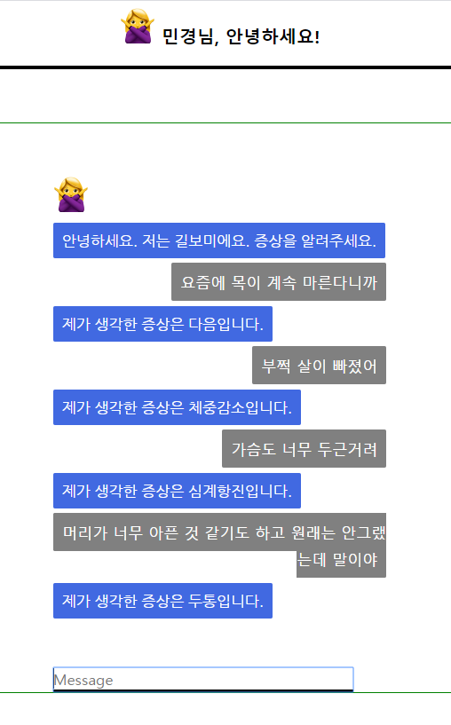
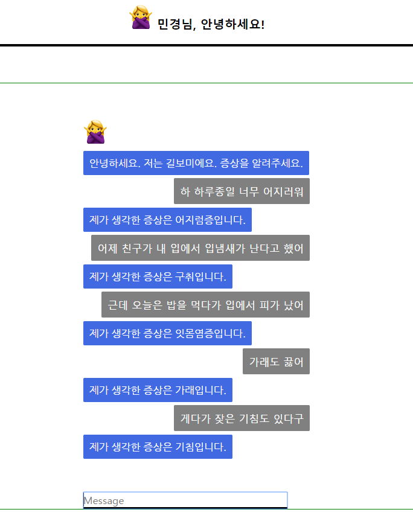
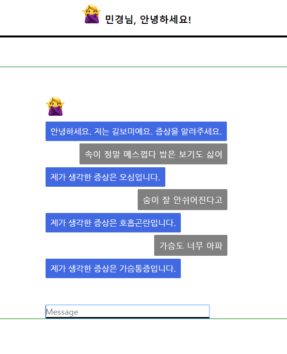
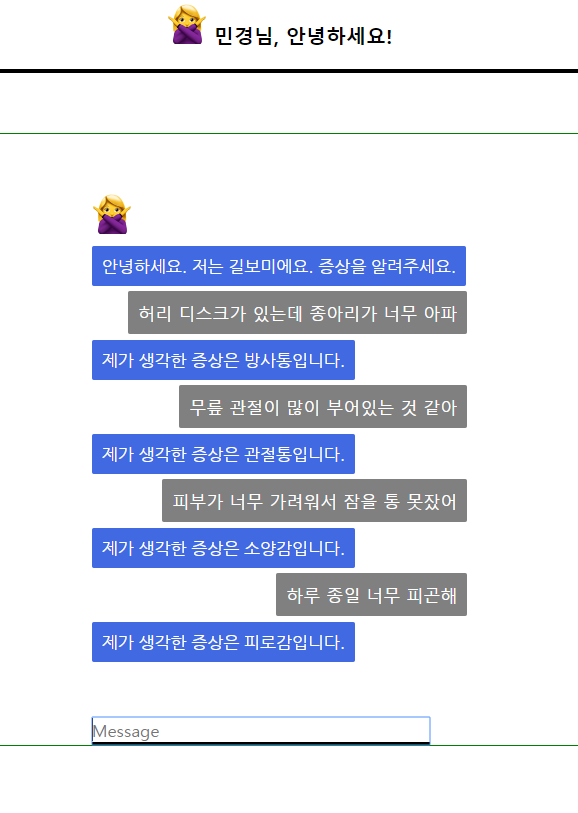
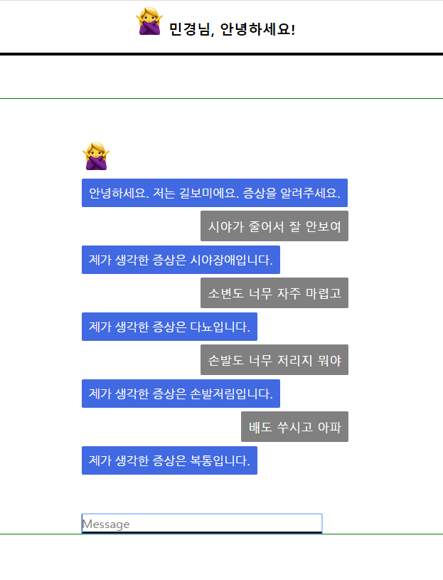
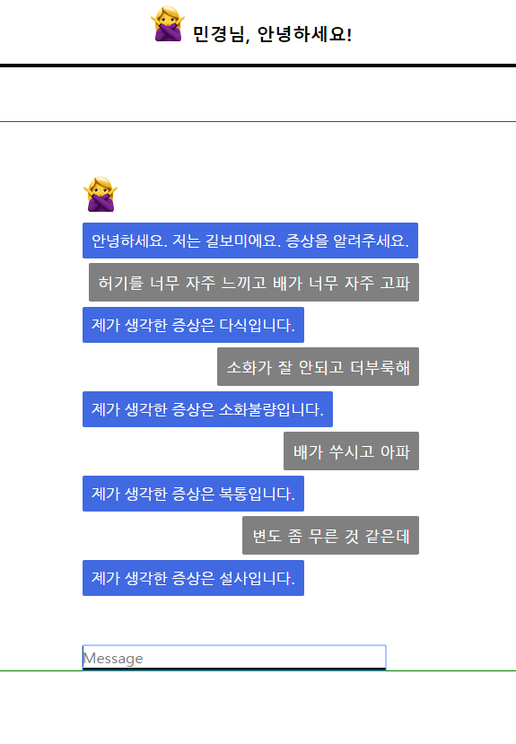
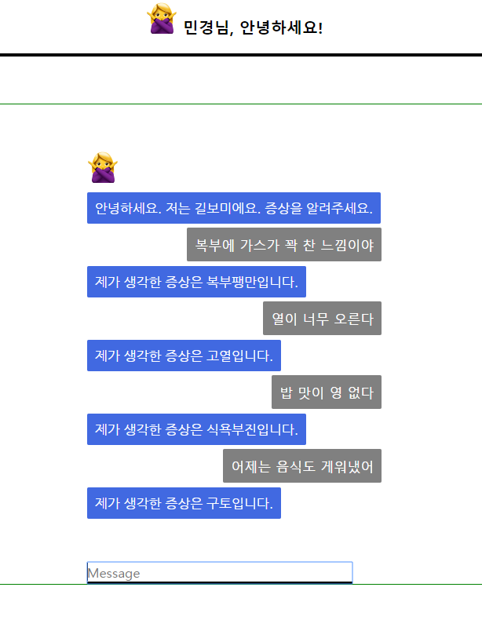
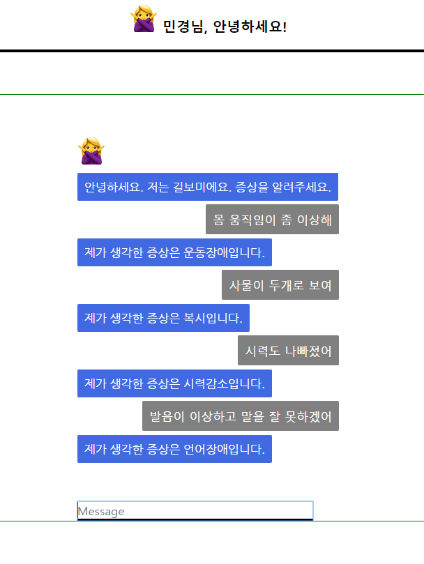

# diseaseRecognitionChatbot
질병증상 질문 챗봇 (flask+keras)


# 폴더 구조
```bash
├── deaseseRecognitionChatbot/ 
    ├── app.py                  - 앱실행 모듈
    ├── predict.py              - biLSTM모델 불러와 예측 처리
    │
    ├── templates/              - 인터페이스 html파일
    │       └── main.html
    │
    ├── static/                 - 기타 리소스
    └── readme/                 - 리드미파일 삽입용 이미지
```

<br>
<br>

# 질병 증상 분류 챗봇
- BiLSTM 모델 사용
- 데이터 115,711개의 증상 질문 지식인 데이터(크롤링)
- Multi Class Classification
- 클래스 36가지 (가래, 가슴통증, 두통, 등 ..)

# 예측 모델 구조
Layer(type) | OutputShape | Param #
---|:---:|---:
`embedding_1 (Embedding)` | **(None, 512, 256)** | `3,545,600`
`bidirectional_1 (Bidirectional)` | **(None, 512, 128)** | `164,352`
`global_max_pooling1d_1 (GlobalMaxPool1D)` | **(None, 128)** | `0`
`dropout_1 (Dropout)` | **(None, 128)** | `0`
`dense_1 (Dense)` | **(None, 32)** | `4,128`
`dropout_2 (Dropout)` | **(None, 32)** | `0`
`dense_2 (Dense)` | **(None, 36)** | `1,188`
Total params : 3,715,268 <br>Trainable params : 169,668<br>Non-trainable paramas : 3,545,600 |


# 모델 성능
 | Precision | Recall | F1-score
---|:---:|:---:|---:
Micro avg | 0.92 | 0.90 | 0.91
Weighted avg | 0.93 | 0.93 | 0.93


# 실행 화면
<br>

<br>

<br>

<br>

<br>

<br>

<br>

<br>

<br>

# Extra
- 구분 된 증상으로 의심되는 질병 알려주기
- predict_proba이용, 예측 성능이 좋지 않은 질문 제외하기